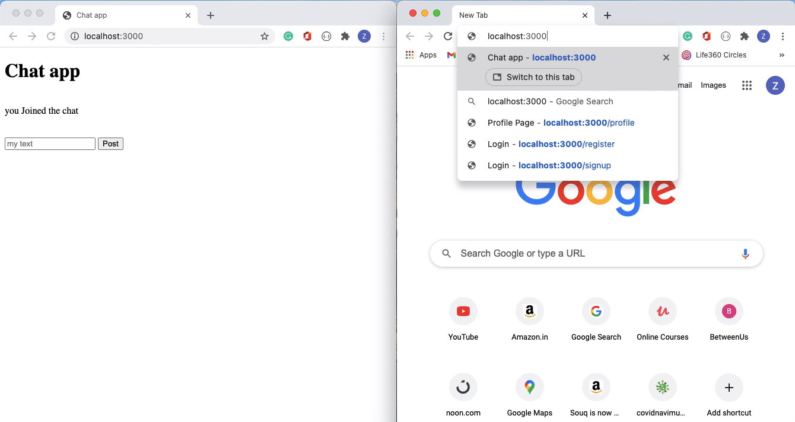

# live-chat-app

## Description

Realtime chat app made using HTML and javascript with the help of node js and socket.io

## preview



## Procedure to run

```sh
$ git clone https://github.com/zaidajani/live-chat-app.git 

# Copy the project

$ cd live-chat-app

# Get inside live-chat-app directory

$ npm i 

# to install all the dependencies

$ npm run dev

# to run the project, then head over to your browser and localhost:3000, to see your application in action
```

## Enjoy your powerfull application.
